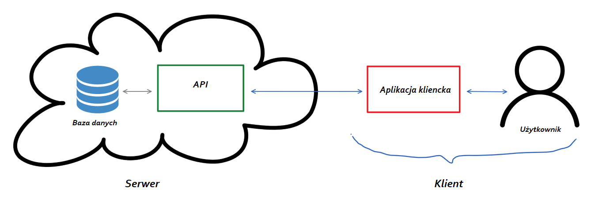

# Informacje ogólne

**Nazwa projektu**: SWiZLE *(System Wymian i Zapisów na Lektoraty Elektroniczny)*

**Opis projektu**: Aplikacja internetowa umożliwiająca rejestrowanie się na lektoraty z języka obcego, pisanie opinii o nich oraz dostarczająca wygodny system wymiany terminów między studentami.

# Przykłady użycia

ESWL pozwala na prace w dwóch trybach: **administratora** oraz **użytkownika**. Aplikacja przechodzi w odpowiedni tryb pracy dzięki sprawdzeniu roli użytkownika po zalogowaniu.

**Tryb administratora umożliwia:**

- Tworzenie, edycja i przeglądanie zbioru lektoratów dostępnych do zarejestrowania się dla użytkowników
- Wypisywanie listy zarejestrowanych studentów oraz lektoratów, na które się zapisali
- Wypisywanie informacji o wymianach dokonanych przez studentów

**Tryb użytkownika umożliwia:**

- Logowanie i rejestrację
- Zapisanie się na dostępne lektoraty
- Wystawienie ogłoszenia o chęć wymiany określonego lektoratu na inny
- Przeglądanie ogłoszeń o chęć wymiany
- Odpowiedź na ogłoszenie wymiany innego użytkownika
- Pisanie i przeglądanie opinii o lektoratach

**Akcje podejmowane automatycznie**:

- Okresowe uruchomienie algorytmu, który automatycznie dokona wymiany między studentami, którzy wystawili uzupełniające się ogłoszenia (np. student A [pon. 12, chce czw. 10] i student B [czw. 10, chce pon. 12] zostaną automatycznie wymienieni)
- *(opcjonalne) Automatyczne wysyłanie powiadomień mailowych do studentów po dokonanej wymianie*

# Architektura programistyczna

Technologie do wykorzystania w projekcie:

- **Spring Boot** - API
- **React.js** - aplikacja kliencka
- Baza danych **Oracle**

